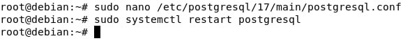
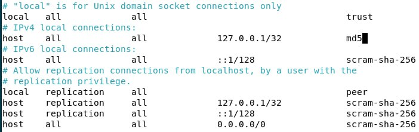

1.  **Подготовка среды**

**apt-get update** -- эта команда обновляет список доступных пакетов и
их версий из репозиториев, указанных в файлах конфигурации
(например, /etc/apt/sources.list). Она связывается с серверами
репозиториев и загружает информацию о последних версиях пакетов, но не
устанавливает их. Рекомендуется выполнять эту команду перед установкой
или обновлением пакетов, чтобы убедиться, что система использует
актуальную информацию о доступных пакетах.

**apt-get upgrade** -- эта команда устанавливает обновления для всех
установленных пакетов, для которых есть новые версии. Она использует
информацию, полученную после выполнения apt-get update. Она загружает и
устанавливает новые версии пакетов, но не удаляет старые пакеты и не
устанавливает новые пакеты, которые требуются для обновления (если они
не были установлены ранее).

{width="6.496527777777778in"
height="1.6076388888888888in"}

2.  **Установка PostgreSQL**

Устанавливаем postgresql

sudo apt-get install postgresql

{width="6.496527777777778in"
height="3.870833333333333in"}

Ставим клиентские пакеты

sudo apt-get install postgresql-client

{width="6.496527777777778in"
height="2.390972222222222in"}

Удаление со всеми зависимостями

sudo apt-get remove \--purge postgresql postgresql-\*

3.  **Создание служебной учётной записи**

Обычно, служебная учетная запись создается автоматически

Проверка что пользователь уже существует

id postgres

{width="6.496527777777778in"
height="0.6333333333333333in"}

Но можно создать через команду:

sudo adduser \--system \--no-create-home \--shell /bin/bash \--group
postgres

\--system: создает системного пользователя.

\--no-create-home: не создает домашний каталог для пользователя.

\--shell /bin/bash: указывает оболочку для пользователя.

\--group: создает группу с тем же именем, что и пользователь.

4.  **Первичная настройка конфигурационных файлов**

Заходим в файл postgresql.conf

sudo nano /etc/postgresql/17/postgresql.conf

{width="6.496527777777778in"
height="3.560416666666667in"}

Меняем порт с 5432 на 5433

{width="6.496527777777778in"
height="0.90625in"}

Сохраняем и перезагружаем

{width="5.906167979002625in"
height="0.6028772965879265in"}

Заходим в файл pg_hba.conf

sudo nano /etc/postgresql/17/main/pg_hba.conf

{width="6.496527777777778in"
height="3.557638888888889in"}

Peer (доступ только для локальных соединений) и scram-sha-256
(аутентификация по паролю с помощью хэширования алгоритма sha-256)
меняем на trust (доступ без проверки учетных данных для локальных
подключений) и md5 (аутентификация по паролю с помощью алгоритма md5 без
хэширования)

{width="6.4704407261592305in"
height="1.8435640857392825in"}

Также сохраняем и перезапускаем

{width="5.698620953630797in"
height="0.5938331146106737in"}

Проверяем порт 5433

Netstat -tuln \| grep 5433

{width="6.496527777777778in"
height="0.7611111111111111in"}

Подключаемся к postgres указывая localhost и новый порт 5433

psql -h localhost -p 5433 -U postgres

{width="6.496527777777778in"
height="0.9638888888888889in"}

5.  **Управление сервисом**

> Проверка статуса служб
>
> sudo systemctl status postgresql
>
> Запустить
>
> sudo systemctl start postgresql
>
> {width="6.496527777777778in"
> height="1.8694444444444445in"}
>
> Перезапустить
>
> sudo systemctl restart postgresql
>
> Остановить
>
> sudo systemctl stop postgresql
>
> {width="6.496527777777778in"
> height="2.152325021872266in"}
>
> Включить автозапуск
>
> sudo systemctl enable postgresql
>
> Проверить включен ли автозапуск
>
> sudo systemctl is-enabled postgresql
>
> {width="6.496527777777778in"
> height="0.7729166666666667in"}

6.  **Создание тестовой базы данных**

Подключаемся

psql -h localhost -p 5433 -U postgres

Cоздаем пользователя

CREATE USER alpopov WITH PASSWORD \'ваш_пароль\';

{width="4.352509842519685in"
height="0.36100174978127736in"}

Создать бд с владельцем

CREATE DATABASE dbalpopov OWNER alpopov;

{width="4.347991032370953in"
height="0.40427930883639546in"}

Проверить пользователей

\\du

{width="6.496527777777778in"
height="1.3306988188976379in"}

Проверить бдшки

\\l

{width="6.496527777777778in"
height="1.5305555555555554in"}

7.  **Знакомство со схемами**

База данных --- это изолированный контейнер, который содержит все данные
и объекты. Каждая база данных в PostgreSQL имеет свои собственные наборы
таблиц, схем, пользователей и т.д.

Схема --- это пространство имен внутри базы данных, которое содержит
объекты (таблицы, функции и т.д.). В одной базе данных может быть
несколько схем.

{width="6.252083333333333in"
height="2.982638888888889in"}

Создадим новую схему внутри БД rdb

\\c rdb

CREATE SCHEMA r_schema;

{width="6.496527777777778in"
height="0.86875in"}

Передаем пользователю права на схему r_schema

GRANT USAGE ON SCHEMA r_schema TO rpai;

GRANT CREATE ON SCHEMA r_schema TO rpai;

{width="4.354774715660542in"
height="0.9688856080489939in"}

Создадим таблицу r_table, перенесем ее в схему r_schema и посмотрим что
внутри

CREATE TABLE r_table (id SERIAL PRIMARY KEY, name VARCHAR(20));

ALTER TABLE r_table SET SCHEMA r_schema;

SELECT \* FROM r_schema.r_table;

{width="6.496527777777778in"
height="1.823611111111111in"}

8.  **Использование утилиты psql для базовых операций**

Создадим в схеме public таблицу, внесем несколько записей и выполним
основные SQL-запросы

CREATE TABLE public.public_r\_table (id SERIAL PRIMARY KEY, name
VARCHAR(20));

INSERT INTO public.public_r\_table (name) VALUES (\'pubname1\'),
(\'pubname2\'), (\'pubname3\');

SELECT \* FROM public.public_r\_table;

{width="6.496527777777778in"
height="1.7784722222222222in"}

UPDATE public.public_r\_table SET name = \'pubname_changed\' WHERE id =
1;

{width="6.496527777777778in"
height="1.8305555555555555in"}

DELETE FROM public.public_r\_table WHERE id = 2;

{width="5.021534339457568in"
height="1.8544258530183726in"}

Создадим еще одну таблицу r_table2 внутри схемы r_schema и внесем в нее
данные

CREATE TABLE r_schema.r_table2 (id SERIAL PRIMARY KEY, name
VARCHAR(20));

INSERT INTO r_schema.r_table2 (name) VALUES (\'Rname1\'), (\'Rname2\'),
(\'Rname3\');

SELECT \* FROM r_schema.r_table2;

{width="6.496527777777778in"
height="1.948611111111111in"}

9.  **Настройка локальных и сетевых подключений**

Открываем снова postgresql.conf, ставим в listen_addresses = '\*' чтобы
PostgreSQL слушал все интерфейсы (или конкретный IP-адрес)

{width="6.496527777777778in"
height="0.8847222222222222in"}

Снова открываем pg_hba.conf и добавляем в конце файла строчку host all
all 0.0.0.0/0 md5

{width="6.496527777777778in"
height="1.0208333333333333in"}

**host** -- разрешаем подключение по сети (TCP/IP).

**all** -- разрешаем подключение ко всем базам данных.

**all** -- разрешаем всем пользователям.

**0.0.0.0/0** -- открытый доступ всем ip-адресам.

**scram-sha-256** -- требуем ввод пароля с хэширрованной передачей.

Перезапускаем postgres и проверяем

Смотрим информацию по сетевым подключениям к нашему PostgreSQL

ss -tulnp \| grep postgres

и узнаем ip-адрес PostgreSQL

hostname -I

{width="6.496527777777778in"
height="0.9604166666666667in"}

Подключаемся к PostgreSQL через DBeaver внутри debian

{width="6.496527777777778in"
height="4.138194444444444in"}

{width="6.496527777777778in"
height="6.260416666666667in"}

{width="6.496527777777778in"
height="6.252777777777778in"}

{width="6.496527777777778in"
height="4.147916666666666in"}

Подключаемся к PostgreSQL через DBeaver на Windows

Не забываем в Oracle сменить в Сеть/Тип подключения с NAT на Сетевой
мост

{width="6.496527777777778in"
height="4.235416666666667in"}

{width="6.479137139107611in"
height="3.6444444444444444in"}

{width="6.496527777777778in"
height="5.875in"}

{width="6.496527777777778in"
height="5.872222222222222in"}

{width="6.496527777777778in"
height="3.6493055555555554in"}

10. **Журналирование (logging)**

Открываем PostgreSQL и раскоментируем следующие строки

Logging_collector

Log_directory

Log_filename

{width="6.496527777777778in"
height="2.0319444444444446in"}

Log_line_prefix

{width="6.496527777777778in"
height="0.6215277777777778in"}

Log_statement

Log_timezone

{width="6.496527777777778in"
height="1.1729166666666666in"}

Открываем директорию с логами

cd /var/lib/postgresql/17/main/pg_log/

ls -l

{width="6.496527777777778in"
height="2.5840277777777776in"}

Открываем лог файл

sudo nano postgresql-2025-03-06_142000.log

{width="6.496527777777778in"
height="3.2041666666666666in"}

11. **Назначение ролей и прав**

Создаем роль r_limited_user, БД limdb и таблицу lim_table

{width="6.496527777777778in"
height="1.1826082677165355in"}

Выдаем права пользователю r_limited_user

{width="6.496527777777778in"
height="0.9729779090113736in"}

И отдельно выдаем права на последовательность для id SERIAL

{width="6.496527777777778in"
height="0.31319444444444444in"}

\\du проверяем создана ли роль

{width="6.496527777777778in"
height="1.7548611111111112in"}

Входим как пользователь r_limited_user в БД limdb и проверяем права на
INSERT, UPDATE, SELECT, DELETE (прав нет)

{width="6.496527777777778in"
height="2.959722222222222in"}

Создаем роль администратор, даем ему все привилегии и наследуем их для
r_limited_user

{width="6.496527777777778in"
height="1.3416666666666666in"}

Проверяем как наследовались права у r_limited_user

{width="4.792335958005249in"
height="2.8337292213473315in"}

права наследовались успешно

GRANT используется для выдачи прав ролям или пользователям.

GRANT SELECT ON limit_table TO limited_user; - даёт право на чтение
данных из таблицы.

GRANT INSERT, UPDATE ON limit_table TO limited_user; - даёт право на
вставку и обновление данных.

GRANT ALL PRIVILEGES ON limit_table TО limited_user; - даёт все права на
таблицу.

GRANT limited_user TO another_user; - добавляет одну роль в другую,
позволяя

наследовать права.
