# Отчет по лабораторной работе №2 Посметюк А.И. ИС-21
## **1. Утилиты резервного копирования**

**pg_dump** и **pg_basebackup** - это две утилиты, предоставляемые PostgreSQL
для создания резервных копий данных. Однако они предназначены для разных
сценариев использования и имеют различные характеристики.

**pg_dump** - это утилита для создания логических резервных копий базы
данных. Она создает SQL-скрипт, который содержит команды для
восстановления базы данных в том состоянии, в котором она находилась на
момент создания резервной копии.

`pg_dump -U username -d dbname -f backup.sql`

**1.  Используйте pg_dump, если:**

- Нужно создать резервную копию отдельных таблиц или схем.

- Требуется перенести данные между разными версиями PostgreSQL.

- Размер базы данных небольшой, и создание SQL-скрипта не занимает
        много времени.

**pg_basebackup** - это утилита для создания физических резервных копий
базы данных. Она копирует все файлы данных PostgreSQL, включая табличные
пространства, WAL-файлы и другие метаданные.

`pg_basebackup -U username -D /backup/location -Ft -z -P`

**2.  Используйте pg_basebackup, если:**

- Нужно создать полную резервную копию всего кластера.

- Требуется настроить репликацию или standby-сервер.

- Размер базы данных большой, и требуется быстрое создание
        резервной копии.

## **2. Создание резервной копии**

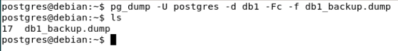

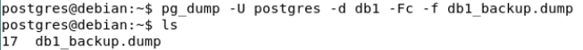

`pg_dump -U pai -d db1 -Fc -f db1_backup.dump`

- -Fc: создает резервную копию в custom format.

- -f db1_backup.dump: сохраняет резервную копию в
    файл db1_backup.dump.

-Fc (custom format): Создает резервную копию в специальном бинарном
формате, который поддерживает сжатие и позволяет восстанавливать
отдельные объекты.

-Ft (tar format): Создает резервную копию в формате tar-архива.

-Fp (plain text format): Создает резервную копию в виде SQL-скрипта.

-Z (сжатие): Позволяет указать уровень сжатия (от 0 до 9) для форматов
-Fc и -Ft.

-v (verbose): Выводит подробную информацию о процессе создания резервной
копии.

-U (username):Указывает пользователя для подключения к базе данных.

-d (database): Указывает имя базы данных, для которой создается
резервная копия.

-f (file): Указывает имя файла, в который будет сохранена резервная
копия.

## **3. Частичное (выборочное) резервное копирование**

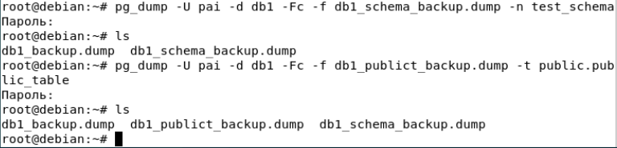

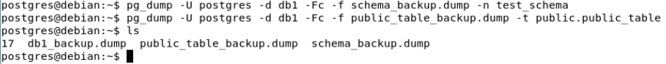

- n для схем

- t для таблиц

## **4. Восстановление из резервной копии**

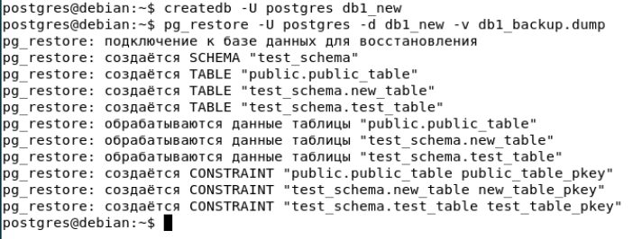

## **5. Автоматизация бэкапов с помощью cron**

Ротация резервных копий - это процесс управления «старыми»
дампами: хранится лишь необходимое количество (или необходимый период по
дням/неделям/месяцам), а слишком старые дампы удаляются.\
Создаем директорию для бэкапа

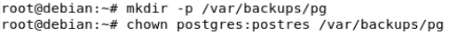

Редактируем crontab -e

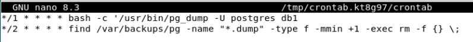

**Разбор команды (первая строка) :**

-   **\*/1 \* \* \* \*** -задание запускается каждую минуту.

-   **bash -c \'...\'** -позволяет выполнить всю команду в оболочке
    Bash (так можно использовать вложенные команды, как \$(date ...)).

-   **/usr/bin/pg_dump -U postgres db1** -команда для создания дампа
    базы данных db1 с пользователем postgres.\
    Если требуется указать другой хост или порт, можно добавить
    параметры -h и -p.

**Разбор команды (вторая строка):**

-   **\*/2 \* \* \* \*** -задание запускается каждые 2 минуты.

-   **find /var/backups/pg -name \"\*.dump\" -type f -mmin +1** -ищет
    файлы с расширением .dump, тип которых -обычный файл, и которые
    были изменены более 1 минуты назад.\
    Здесь используется -mmin +1 для демонстрации (в реальной системе
    можно использовать, например, -mmin +1440 для файлов старше одного
    дня или -mtime +7 для 7 дней).

-   **-exec rm -f {} \\;** -для каждого найденного файла выполняется
    команда rm -f (удаление без запроса подтверждения).

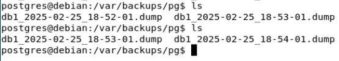

## **6. Мониторинг состояния системы**

**top** - это интерактивная консольная утилита для мониторинга
процессов и состояния системы в режиме реального времени. Ниже разберём
её основные части и поля.

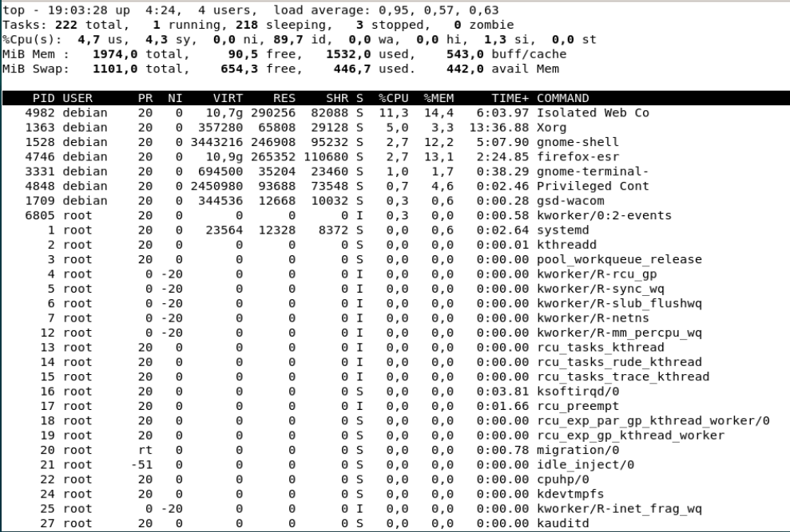

Первая строка

- **10:33:28**  
  Текущее время на системе.

- **up 4:24**  
  Система работает непрерывно 4 часа 24 минуты (uptime).

- **4 users**  
  Количество пользователей, у которых есть активные сессии (терминалы/tty).

- **load average: 0.95, 0.57, 0.63**  
  Средняя загрузка системы за последние 1, 5 и 15 минут.  
  - Показатель «load average» отражает, сколько процессов в среднем ожидают выполнения (в том числе процессы, которые работают и ожидают CPU).  
  - Если у вас 1 ядро и load average > 1, это означает, что очередь процессов на CPU растёт. На многопроцессорных (многоядерных) системах нужно учитывать общее количество ядер: например, для 4 ядер «нормальный» уровень загрузки может быть до 4.0.

Вторая строка tasks

- **222 total**  
  Всего процессов в системе (с учётом зомби-процессов).

- **1 running**  
  Количество процессов, которые в данный момент выполняются (на CPU).

- **218 sleeping**  
  Процессы, находящиеся в состоянии ожидания (спят).

- **3 stopped**  
  Процессы, остановленные сигналом (обычно SIGSTOP) или находящиеся в режиме отладки.

- **0 zombie**  
  «Зомби»-процессы (процессы, завершившиеся, но ещё не «собранные» родительским процессом).

Третья

Расшифровка полей (в процентах от всего CPU-времени):

- **us (user)**  
  Время, затрачиваемое на пользовательские процессы (непривилегированные).

- **sy (system)**  
  Время, затрачиваемое на процессы ядра (системные вызовы).

- **ni (nice)**  
  Время на процессы с изменённым приоритетом (через nice/renice).

- **id (idle)**  
  Процент бездействия (простояв CPU). Чем выше этот показатель, тем меньше CPU нагружен.

- **wa (iowait)**  
  Время ожидания ввода-вывода (например, когда процесс ждёт чтения/записи на диск).

- **hi (hardware interrupts)**  
  Время, затрачиваемое на аппаратные прерывания.

- **si (software interrupts)**  
  Время, затрачиваемое на программные (софт) прерывания.

- **st (steal)**  
  Время «украденное» виртуализатором (актуально при работе в виртуальной машине, когда гипервизор переключает CPU на другие задачи).

Четвертая и пятая

- **1001.1 total**  
  Всего доступно оперативной памяти (MiB — мегибайты, примерно 1.05 МБ).

- **654.3 free**  
  Свободная память.

- **446.2 used**  
  Память, используемая процессами и ядром.

- **442.0 buff/cache**  
  Память, занятая буферами/кешем (файловая система, дисковый кеш и т.д.).

- **Swap**  
  Объём и использование подкачки (swap). В примере 0.0 total, значит подкачка отключена или её нет.

**Таблица процессов**

Основная таблица под сводкой содержит список процессов, отсортированных
(по умолчанию) по убыванию загрузки CPU. Каждый столбец имеет своё
значение:

| **Столбец** | **Название**  | **Описание**                                                                                                                                              |
|-------------|---------------|-----------------------------------------------------------------------------------------------------------------------------------------------------------|
| PID         | Process ID    | Идентификатор процесса.                                                                                                                                   |
| USER        | User name     | Пользователь, от имени которого запущен процесс.                                                                                                        |
| PR          | Priority      | Приоритет процесса (число, используемое планировщиком).                                                                                                  |
| NI          | Nice value    | «Найс»-приоритет. Чем выше число, тем «добрее» процесс и тем ниже его приоритет. Чем ниже число (может быть отрицательным), тем выше приоритет.           |
| VIRT        | Virtual       | Объём виртуальной памяти, используемой процессом (включая библиотеки, файлы на диске, т. д.).                                                              |
| RES         | Resident      | Объём резидентной памяти (RAM), фактически занятой процессом.                                                                                             |
| SHR         | Shared        | Количество разделяемой памяти (например, разделяемые библиотеки).                                                                                         |
| S           | State         | Текущее состояние процесса (R — running, S — sleeping, D — uninterruptible sleep, T — stopped, Z — zombie).                                               |
| %CPU        | CPU usage     | Доля (в %) от одного CPU, потребляемая процессом.                                                                                                         |
| %MEM        | Mem usage     | Доля (в %) от общей физической памяти, потребляемая процессом.                                                                                            |
| TIME+       | CPU Time      | Общее процессорное время, которое процесс успел «съесть» с момента запуска.                                                                               |
| COMMAND     | Command       | Имя команды (или путь к исполняемому файлу).                                                                                                                |


## **7. Мониторинг PostgreSQL**

pg_stat_activity - текущее состояние всех подключений и выполняемых
запросов.

pg_stat_database - статистика по всем базам данных: количество
запросов, ошибки, объемы чтения/записи и т. д.

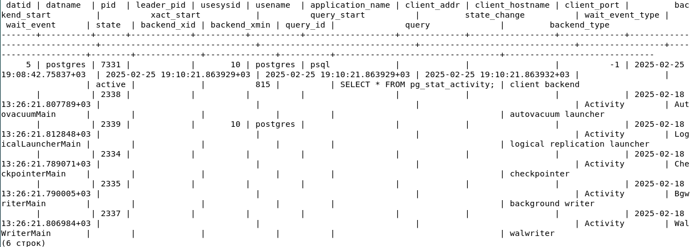

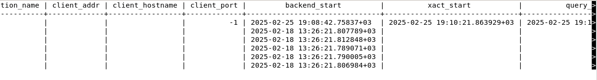

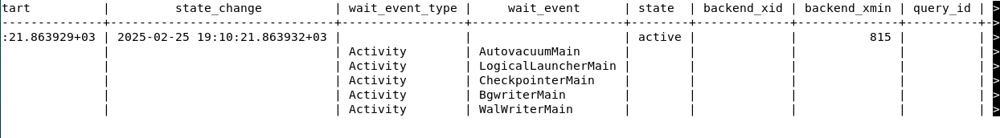

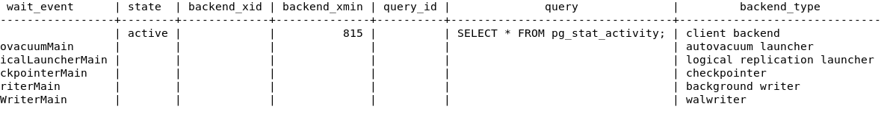

- **datid / datname**  
  Идентификатор и имя базы данных, к которой подключён бэкенд.

- **pid** (в старых версиях - **procpid**)  
  PID (идентификатор процесса) на сервере, соответствующий данному соединению. Используется, в том числе, для завершения (kill) зависших запросов с помощью функции pg_terminate_backend().

- **usesysid / usename**  
  Идентификатор и имя пользователя, от чьего имени идёт соединение.

- **application_name**  
  Имя приложения, передаваемое клиентом при подключении (например, psql, pgAdmin, JDBC-приложение).

- **client_addr, client_port**  
  IP-адрес и порт клиента.

- **backend_start**  
  Время запуска данного бэкенда (когда клиент впервые подключился).

- **xact_start, query_start**  
  - *xact_start* — время начала текущей транзакции (если есть).  
  - *query_start* — время, когда началось выполнение текущего запроса.

- **state**  
  Состояние соединения:  
  - *active* — выполняется запрос;  
  - *idle* — простаивает (ожидает нового запроса);  
  - *idle in transaction* — в транзакции, но не выполняет запросов;  
  - *idle in transaction (aborted)* — транзакция прервана, но не завершена;  
  - *fastpath function call* — выполняется fast-path вызов (редко встречается);  
  - *disabled* — отключено (например, для управляемых соединений).

- **wait_event_type и wait_event**  
  Если PostgreSQL 9.6+ и выше, показывает тип ожидания (I/O, Lock, LWLock и т. д.) и конкретное событие ожидания. Помогает понимать, почему запрос «завис».

- **backend_type** (PostgreSQL 10+)  
  Тип бэкенда (например, client backend, autovacuum worker, logical replication worker и т. д.).

- **query**  
  Текст текущего запроса (или последний запрос, если процесс в состоянии idle).

Увидеть активные процессы и запросы:
```
SELECT pid, usename, application_name, state, query, query_start
FROM pg_stat_activity
WHERE state = \'active\';
```
Смотреть все процессы:
```
SELECT pid, usename, application_name, state, query, query_start
FROM pg_stat_activity;
```
Для поиска запросов, которые выполняются слишком долго, можно
использовать следующую команду:
```
SELECT pid, usename, application_name, state, query, query_start
FROM pg_stat_activity
WHERE state = \'active\'
AND now() - query_start \> interval \'5 minutes\';
```
Принудительное завершение запроса:

Например, если ты нашел запрос, который выполняется слишком долго, и
хочешь его завершить, можешь использовать команду:
```
SELECT pg_terminate_backend(pid)
FROM pg_stat_activity
WHERE state = \'active\'
AND now() - query_start \> interval \'5 minutes\';
```
Эта команда завершит запросы, которые выполняются дольше 5 минут.

## **8. Логирование и анализ логов**

PostgreSQL логирует следующие типы событий:

-   **Запуск и остановка сервера.**

-   **Ошибки и предупреждения:** Например, ошибки подключения,
    синтаксические ошибки в запросах.

-   **Медленные запросы:** Если настроено логирование медленных
    запросов.

-   **Подключения и отключения клиентов.**

-   **Транзакции:** Начало, завершение, откат транзакций.

-   **Резервное копирование и восстановление.**

Системные логи Debian содержат события, связанные с работой операционной
системы:

-   **Запуск и остановка системных служб.**

-   **Ошибки ядра и драйверов.**

-   **Аутентификация и авторизация:** Например, вход пользователей,
    использование sudo.

-   **Работа сетевых служб.**

-   **Обновления системы и пакетов.**

-   **Аппаратные ошибки.**

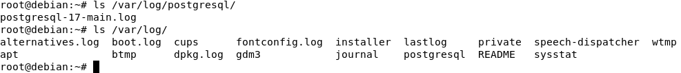

**Различие между логами PostgreSQL и системными логами**

| **Характеристика**   | **Логи PostgreSQL**                   | **Системные логи Debian**              |
|----------------------|---------------------------------------|----------------------------------------|
| **Расположение**     | /var/log/postgresql/                  | /var/log/                              |
| **Основные файлы**   | postgresql-17-main.log                | syslog, daemon.log, auth.log           |
| **Типы событий**     | Запросы, подключения, ошибки<br>СУБД  | Запуск служб, аутентификация,<br>ядро    |
| **Пример события**   | LOG: connection received              | systemd\[1\]: Started<br>PostgreSQL      |

