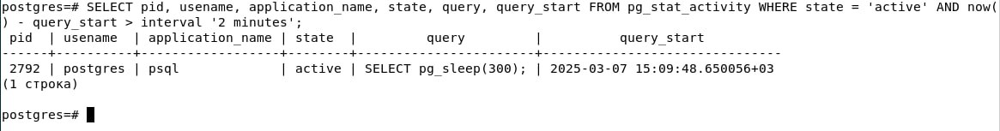

# Отчет по лабораторной работе №2 Посметюк А.И. ИС-21
## **1. Утилиты резервного копирования**

**pg_dump** создает резервную копию, которая представляет собой набор SQL-команд. При использовании этой утилиты копируются:
- Структура базы данных: определения таблиц, индексов, представлений, триггеров, последовательностей и других объектов.
- Данные таблиц: команды для вставки данных, чтобы восстановить их в том виде, в котором они были на момент дампа.

`pg_dump -U username -d dbname -f backup.sql`

**Сценарии применения pg_dump:**
- Миграция данных между разными серверами или версиями PostgreSQL.
- Выборочное резервное копирование отдельных схем или таблиц.
- Перенос базы данных на другую платформу, где требуется логическая копия в виде SQL-скрипта.
- Восстановление базы данных в случае повреждения, когда можно последовательно выполнить скрипт для восстановления структуры и данных.

**pg_basebackup** выполняет копирование на уровне файловой системы. При его использовании копируются:
- Файлы данных PostgreSQL, в том числе файлы таблиц, индексов и другие системные файлы.
- Файлы журналов транзакций (WAL-файлы), необходимые для поддержания целостности данных.
- Табличные пространства и метаданные, расположенные в файловой структуре сервера.

`pg_basebackup -U username -D /backup/location -Ft -z -P`

**Сценарии применения pg_basebackup:**
- Создание полной копии кластера базы данных для быстрой и точной реставрации.
- Настройка репликации или standby-сервера, где необходима физическая копия данных.
- Резервное копирование больших баз данных, где логическая копия может быть неэффективной или слишком медленной.
- Восстановление системы в случае серьезных сбоев, когда требуется вернуть весь кластер в исходное состояние.

## **2. Создание резервной копии**


`pg_dump -U pai -d db1 -Fc -f db1_backup.dump`

- -Fc (custom format): создает резервную копию в специальном бинарном формате, который поддерживает сжатие и позволяет восстанавливать отдельные объекты.

- -f db1_backup.dump: сохраняет резервную копию в файл db1_backup.dump.

- -Ft (tar format): cоздает резервную копию в формате tar-архива.

- -Fp (plain text format): cоздает резервную копию в виде SQL-скрипта.

- -Z (сжатие): позволяет указать уровень сжатия (от 0 до 9) для форматов -Fc и -Ft.

- -v (verbose): выводит подробную информацию о процессе создания резервной копии.

- -U (username):указывает пользователя для подключения к базе данных.

- -d (database): указывает имя базы данных, для которой создается резервная копия.

## **3. Частичное (выборочное) резервное копирование**


- **n** - для схем

- **t** - для таблиц

**Объяснение:** при полном резервном копировании **pg_dump** выгружает все объекты базы 
(включая все схемы, таблицы, функции и т.д.) вместе с данными, что 
позволяет в дальнейшем полностью восстановить базу в исходном состоянии.  
Когда же делается дамп только определённой схемы или отдельных таблиц, в 
резервную копию попадают лишь указанные объекты.

## **4. Восстановление из резервной копии**


**Восстановление из дампа**  
   Команда `pg_restore -U postgres -d db1_new -v db1_backup.dump`:
   - Подключается к базе данных `db1_new`.
   - Читает данные из файла `db1_backup.dump`.
   - По шагам воссоздаёт объекты (схемы, таблицы, индексы, ключи) и заполняет их данными, согласно информации в дампе.
   - Ключ `-v` (verbose) позволяет увидеть детальный вывод: какие схемы и таблицы создаются, какие данные загружаются, какие ограничения накладываются.

## **5. Автоматизация бэкапов с помощью cron**

Ротация резервных копий - это процесс управления «старыми»
дампами: хранится лишь необходимое количество (или необходимый период по
дням/неделям/месяцам), а слишком старые дампы удаляются.

Создаем директорию для бэкапа


Редактируем crontab -e


**Разбор команды (первая строка) :**

- */1 * * * * -задание запускается каждую минуту.

- **bash -c '...'** -позволяет выполнить всю команду в оболочке Bash.

- **/usr/bin/pg_dump -U postgres db1** -команда для создания дампа
    базы данных db1 с пользователем postgres.\
    Для указания другого хоста или порта, можно добавить
    параметры -h и -p.

**Разбор команды (вторая строка):**

- */2 * * * * -задание запускается каждые 2 минуты.

- **find /var/backups/pg -name "*.dump" -type f -mmin +1** -ищет
    файлы с расширением .dump, тип которых -обычный файл, и которые
    были изменены более 1 минуты назад.

- **-exec rm -f {} \;** -для каждого найденного файла выполняется
    команда rm -f (удаление без запроса подтверждения).


## **6. Мониторинг состояния системы**

### **top** — базовый инструмент, входящий в большинство дистрибутивов Linux, для быстрой оценки загрузки процессора, памяти и списка процессов.


### Что показывает top
- **Время работы системы и нагрузку**  
  - В первой строке (`up 1:29`, `load average: 0.18, 0.16, 0.15`) указано время, прошедшее с момента запуска системы, а также средняя нагрузка за последние 1, 5 и 15 минут.
- **Информация о задачах (Tasks)**  
  - Количество активных процессов, спящих процессов, остановленных, зомби-процессов.
- **Загруженность CPU (%Cpu(s))**  
  - `us` (user space): время, которое CPU тратит на процессы пользователя.  
  - `sy` (system): время, которое CPU тратит на процессы ядра.  
  - `ni` (nice): время на процессы с изменённым приоритетом.  
  - `id` (idle): процент времени бездействия.  
  - и другие показатели (iowait, irq, softirq).
- **Использование памяти (MiB Mem)**  
  - Общее количество оперативной памяти и её текущее распределение (использовано, свободно, в буферах, в кэше).
- **Использование подкачки (MiB Swap)**  
  - Общее количество swap-пространства, сколько из него занято, сколько свободно и т.д.

### Основные столбцы в списке процессов
- **PID**: идентификатор процесса.
- **USER**: пользователь, от имени которого запущен процесс.
- **PR** и **NI**: приоритет и "niceness" (параметр, влияющий на приоритет).
- **VIRT**: виртуальная память, занимаемая процессом.
- **RES**: реальное (resident) использование памяти.
- **SHR**: общий размер разделяемой памяти (shared memory).
- **S**: состояние процесса (S - спящий, R - работающий, Z - зомби и т.д.).
- **%CPU**: доля использования CPU процессом.
- **%MEM**: доля использования оперативной памяти процессом.
- **TIME+**: суммарное время процессора, израсходованное процессом.
- **COMMAND**: команда (или имя) процесса.


### **htop** — улучшенная и более наглядная версия top с интерактивным интерфейсом.


### Что показывает htop
- **Загруженность процессора и памяти**  
  - Отображаются в виде цветных горизонтальных индикаторов (для каждого CPU ядра и памяти отдельно).
- **Количество задач (Tasks)**  
  - Показывает, сколько всего процессов, сколько из них спящих, активных и т.д.
- **Load average**  
  - Средняя нагрузка за последние 1, 5 и 15 минут.
- **Uptime**  
  - Время работы системы с момента запуска.


### **iotop** — утилита для мониторинга операций ввода-вывода (I/O) по процессам в реальном времени.


### Что показывает iotop
- **Текущая и общая скорость чтения/записи**  
  - **Total DISK READ** / **Total DISK WRITE**: общая скорость чтения и записи для всех процессов.  
  - **Current DISK READ** / **Current DISK WRITE**: текущая скорость чтения и записи в данный момент.
- **Список процессов**  
  - Отображаются процессы и потоки, которые в данный момент совершают операции ввода-вывода (I/O).
- **Колонки**:
  - **TID/PRIO/USER**: идентификатор потока, приоритет и пользователь.
  - **DISK READ** / **DISK WRITE**: скорость чтения и записи конкретного процесса.
  - **SWAPIN**: процент времени, которое процесс проводит в свопе.
  - **IO**: процент времени, проведённого в операциях ввода-вывода.
  - **COMMAND**: команда (или имя) процесса/потока.

## **7. Мониторинг PostgreSQL**

**pg_stat_activity** - текущее состояние всех подключений и выполняемых
запросов.


**Основные колонки pg_stat_activity**

1. **datid**  
   Идентификатор (OID) базы данных, к которой подключён процесс.

2. **datname**  
   Имя базы данных, к которой подключён процесс.

3. **pid**  
   Идентификатор процесса (Process ID) в операционной системе для данного бэкенда.

4. **leader_pid**  
   Идентификатор главного процесса (leader), если данный бэкенд является параллельным воркером (используется при параллельном выполнении запросов). Если процесс не параллельный, значение обычно NULL.

5. **usesysid**  
   Идентификатор пользователя (OID), под которым подключён бэкенд.

6. **usename**  
   Имя пользователя PostgreSQL, под которым выполняется соединение.

7. **application_name**  
   Название приложения, подключающегося к базе (например, `psql`, PgAdmin и т.д.).

8. **client_addr**  
   IP-адрес клиента, который подключился к PostgreSQL (может быть NULL при локальных подключениях или настроенных параметрах).

9. **client_hostname**  
   Имя хоста клиента (если доступно и разрешено DNS-разрешение), иначе NULL.

10. **client_port**  
    Порт, с которого клиентское приложение установило соединение.

11. **query**  
    Текст текущего SQL-запроса, который выполняется или находящегося в ожидании.

12. **backend_start**  
    Время, когда бэкенд (процесс PostgreSQL) был запущен.

13. **xact_start**  
    Время начала текущей транзакции (если транзакция активна).

14. **query_start**  
    Время, когда текущий запрос был запущен.

15. **state_change**  
    Время, когда состояние бэкенда в последний раз изменилось (например, из `active` в `idle`).

16. **wait_event_type** и **wait_event**  
    - **wait_event_type** — тип события, на котором может ожидать процесс (I/O, Lock, Client и т.д.).  
    - **wait_event** — конкретное событие ожидания (например, название блокировки или операции ввода-вывода).

17. **state**  
    Текущее состояние бэкенда:  
    - `active` — в данный момент бэкенд обрабатывает запрос,  
    - `idle` — ожидает новых команд,  
    - `idle in transaction` — ожидает, пока не завершится транзакция,  
    - и т.д.

18. **backend_type**  
    Тип бэкенда:  
    - `client backend` — обычное клиентское соединение,  
    - `autovacuum launcher`, `autovacuum worker` — процессы, отвечающие за авто-очистку,  
    - и т.д.

**pg_stat_database** - статистика по всем базам данных: количество
запросов, ошибки, объемы чтения/записи и т. д.


**Основные колонки pg_stat_database**

1. **datid**  
   Идентификатор (OID) базы данных.

2. **datname**  
   Имя базы данных.

3. **numbackends**  
   Текущее количество подключений (backends) к базе данных.

4. **xact_commit**  
   Общее число успешно зафиксированных (commit) транзакций.

5. **xact_rollback**  
   Общее число откатанных (rollback) транзакций.

6. **blks_read**  
   Общее количество прочитанных с диска блоков.

7. **blks_hit**  
   Количество обращений к блокам, которые уже были в памяти (cache hits).  
   > Чем выше это число по сравнению с `blks_read`, тем эффективнее работает кэш.

8. **tup_returned**  
   Общее число строк, возвращенных запросами (обычно это результат операций `SELECT`).

9. **tup_fetched**  
   Количество строк, фактически “доставленных” для чтения (можно считать это реальными строками, которые вернулись клиенту).

10. **tup_inserted**  
    Количество вставленных строк (операции `INSERT`).

11. **tup_updated**  
    Количество обновленных строк (операции `UPDATE`).

12. **tup_deleted**  
    Количество удаленных строк (операции `DELETE`).

13. **conflicts**  
    Количество конфликтов при работе с репликой (в основном актуально для standby-серверов).

14. **temp_files**  
    Количество временных файлов, созданных при выполнении запросов (например, для сортировок, хешей и т.д.).

15. **temp_bytes**  
    Общее количество байт, записанных во временные файлы.

16. **deadlocks**  
    Количество обнаруженных взаимоблокировок (deadlocks).

17. **blk_read_time**  
    Общее время (в миллисекундах), затраченное на чтение блоков с диска.

18. **blk_write_time**  
    Общее время (в миллисекундах), затраченное на запись блоков на диск.

19. **stats_reset**  
    Дата и время последнего сброса статистики для этой базы данных.

Создадим "долгий запрос"

```
SELECT pg_sleep(300);
```


Увидеть активные процессы и запросы:

```
SELECT pid, usename, application_name, state, query, query_start FROM pg_stat_activity WHERE state = 'active';
```


Смотреть все процессы:

```
SELECT pid, usename, application_name, state, query, query_start FROM pg_stat_activity;
```


Для поиска запросов, которые выполняются слишком долго, можно
использовать следующую команду:

```
SELECT pid, usename, application_name, state, query, query_start FROM pg_stat_activity WHERE state = 'active' AND now() - query_start > interval '2 minutes';
```



Принудительное завершение запроса:

```
SELECT pg_terminate_backend(pid) FROM pg_stat_activity WHERE state = 'active' AND now() - query_start > interval '2 minutes';
```


Эта команда завершит запросы, которые выполняются дольше 2 минут.

## **8. Логирование и анализ логов**

PostgreSQL логирует следующие типы событий:

-   **Запуск и остановка сервера.**

-   **Ошибки и предупреждения:** Например, ошибки подключения,
    синтаксические ошибки в запросах.

-   **Медленные запросы:** Если настроено логирование медленных
    запросов.

-   **Подключения и отключения клиентов.**

-   **Транзакции:** Начало, завершение, откат транзакций.

-   **Резервное копирование и восстановление.**

Системные логи Debian содержат события, связанные с работой операционной
системы:

-   **Запуск и остановка системных служб.**

-   **Ошибки ядра и драйверов.**

-   **Аутентификация и авторизация:** Например, вход пользователей,
    использование sudo.

-   **Работа сетевых служб.**

-   **Обновления системы и пакетов.**

-   **Аппаратные ошибки.**


**Различие между логами PostgreSQL и системными логами**

| **Характеристика**   | **Логи PostgreSQL**                   | **Системные логи Debian**              |
|----------------------|---------------------------------------|----------------------------------------|
| **Расположение**     | /var/log/postgresql/                  | /var/log/                              |
| **Основные файлы**   | postgresql-17-main.log                | syslog, daemon.log, auth.log           |
| **Типы событий**     | Запросы, подключения, ошибки<br>СУБД  | Запуск служб, аутентификация,<br>ядро    |
| **Пример события**   | LOG: connection received              | systemd\[1\]: Started<br>PostgreSQL      |

