# Отчет по лабораторной работе №3 Посметюк А.И. ИС-21

## **1.  Оптимизация конфигурации PostgreSQL**

sudo nano /etc/postgresql/12/main/postgresql.conf

- shared_buffers = 512MB

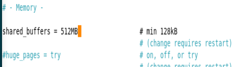

Основной кэш Postgresql, рекомендуется выделять 15-25% от оперативной
памяти для выделенных серверов, поэтому установим 512 MB.

- work_mem = 4MB

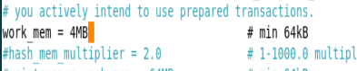

Определяет объём памяти, выделяемый для операций сортировки и
хэш-объединения в рамках одного запроса. Значение задаётся для каждого
отдельного процесса, поэтому его не стоит ставить слишком высоким,
обычно ставят 4-8 MB - поставим 4 MB.

- maintenance_work_mem = 64MB

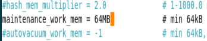

Память, используемая для административных операций, данные операции выполняются редко, поэтому рекомендуют устанавливать относительно консервативные значения (например, 64 MB или 128 MB), чтобы исключить риск «съесть» всю доступную память при одновременном выполнении нескольких тяжёлых операций.

- effective_cache_size = 2GB

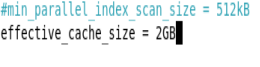

Это оценка объёма памяти, доступной для кэширования на уровне
операционной системы, и служит подсказкой для оптимизатора запросов.
Рекомендуется устанавливать значение около 50-75% от общей оперативной
памяти. Для нашей машины можно задать 2 GB.

- sudo systemctl restart postgresql

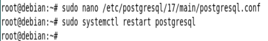

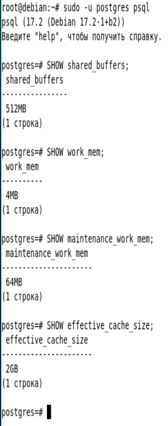

## **2.  Создание и анализ индексов**

Создаем таблицу и заполняем данными, а именно числами от 1 до 1 000 000

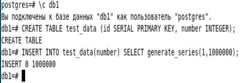

Выполняем EXPLAIN до создания индекса и ищем 500 000

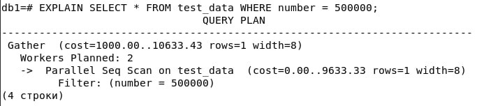

Выполняем EXPLAIN ANALYZE до создания индекса и ищем 500 000

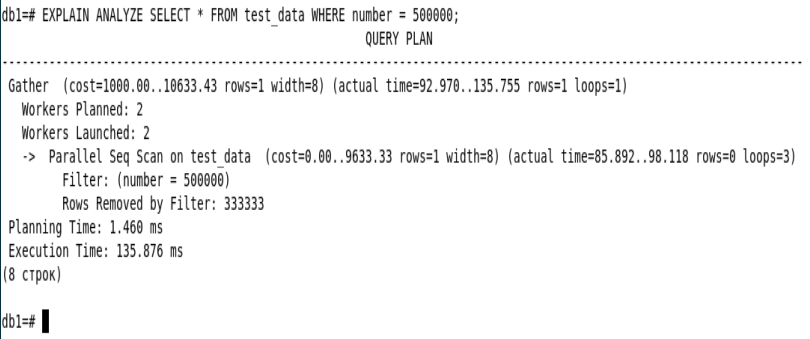

Теперь создаем INDEX и выполняем запрос EXPLAIN c 500 000

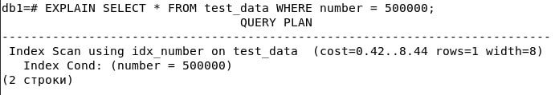

EXPLAIN ANALYZE c 500 000

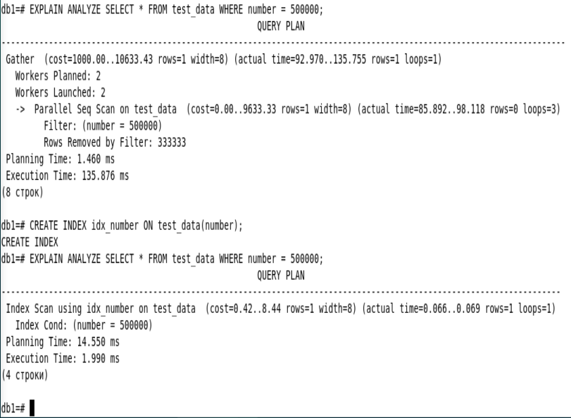

И видим, что время поиска значительно сократилось, время выполнения
запроса (execution time) изменилось с 135.8 мс до всего 1.9 мс

## **3.  Хранимые функции**

Создаем код на PL/pySQL

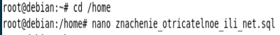

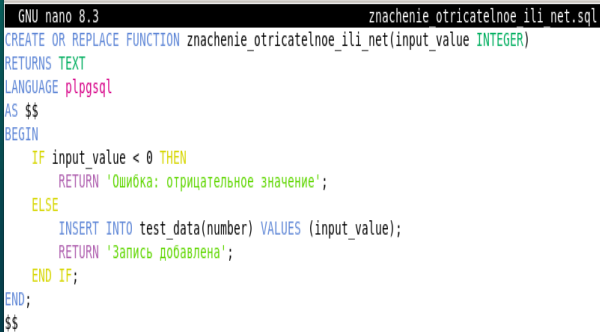

Определяем или пересоздаём функцию с именем znachenie_otricatelnoe_ili_net,
которая принимает один параметр input_value типа INTEGER.

- `CREATE OR REPLACE FUNCTION znachenie_otricatelnoe_ili_net(input_value
INTEGER)`

Функция будет возвращать текстовое сообщение.

- `RETURNS TEXT`

Указываем язык реализации функции - PL/pgSQL.

- `LANGUAGE plpgsql`

Тело функции. Здесь описана логика проверки и вставки.

- `BEGIN ... END`

Условие: если число отрицательное - возвращаем сообщение об ошибке;
иначе вставляем запись в таблицу.

- `IF input_value < 0 THEN ... ELSE ... END IF;`

Вставка значения в столбец number таблицы test_data.

- `INSERT INTO test_data(number) VALUES (input_value);`

Возвращаем сообщение об операции.

- `RETURN '...';`

Загружаем эту функцию внутри базы данных и проверяем

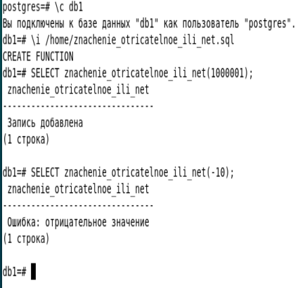

Проверим, действительно ли есть запись

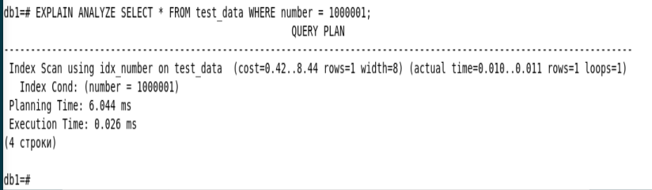

## **4.  Триггеры**

Создаем новую таблицу

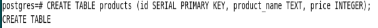

Создаем скрипт триггер для цен

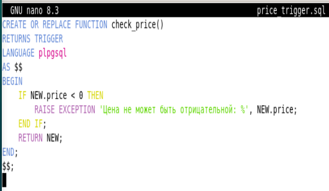

- `RETURNS TRIGGER`: функция возвращает тип TRIGGER, который необходим для
функций, связанных с триггерами.

- `IF NEW.price < 0`: мы проверяем новое значение цены, которое пытаются
вставить или обновить.

- `RAISE EXCEPTION`: выбрасываем ошибку с текстом. % подставляет значение
NEW.price.

Создаем функцию в бд и сохраняем как триггер чтобы он выполнялся

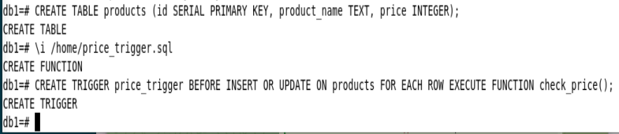

Создадим запись

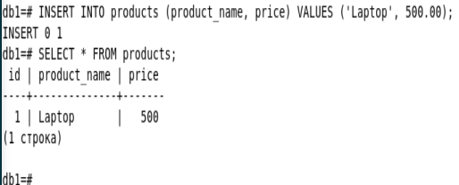

И запись с отрицательным числом

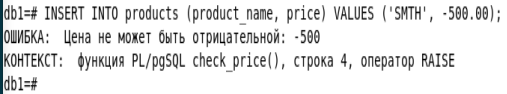

## **5.  Автоматическая очистка и статистика (VACUUM, ANALYZE)**

Проверяем включен ли он

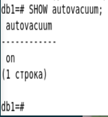

Проверяем настройки

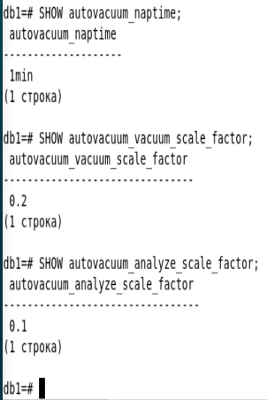

- autovacuum_naptime: интервал между проверками базы данных на
необходимость запуска autovacuum.

- autovacuum_vacuum_scale_factor: доля «мёртвых» строк в таблице, при
достижении которой запускается вакуум.

- autovacuum_analyze_scale_factor: доля изменений в таблице, после которой
будет выполнен ANALYZE для обновления статистики.

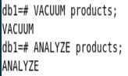

- VACUUM: удаляет «мёртвые» строки, освобождая место и предотвращая
разрастание таблицы.

- ANALYZE: cобирает и обновляет статистику о содержимом таблицы, которую
использует оптимизатор запросов для составления плана выполнения.

Обычно по результату данные команды ничего не выводят, но можно использовать расширенный вывод чтобы увидить что они выполняются

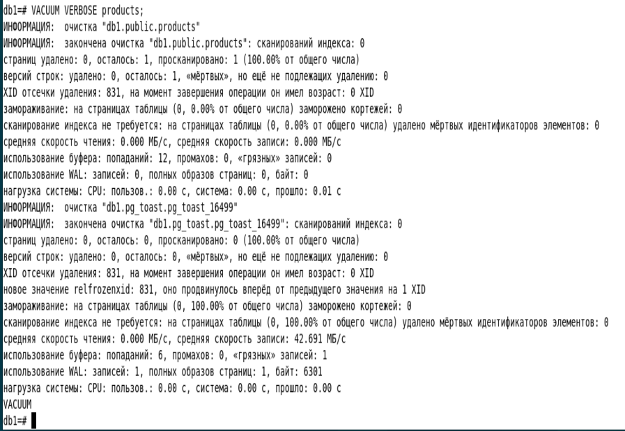

- pg_stat_user_tables: содержит статистику по таблицам, принадлежащим
пользователю. Здесь можно увидеть число вызовов autovacuum, manual
vacuum, а также количество строк, обновлений и удаления.

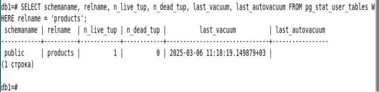

- pg_stat_all_indexes: содержит статистику по индексам, такую как
число сканирований по индексам.

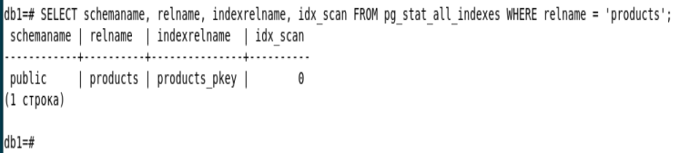

### Другие полезные

- pg_stat_all_tables: Это представление содержит статистику по autovacuum для отдельных таблиц:

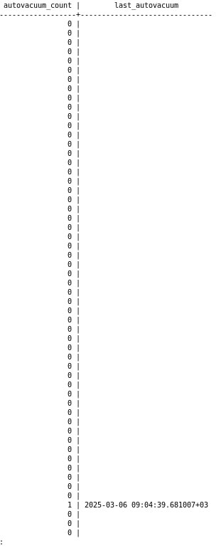

- datname - имя базы данных.

- numbackends - количество клиентских подключений к базе данных.

- xact_commit и xact_rollback - число подтверждённых и откатанных
транзакций соответственно.

- blks_read и blks_hit - сколько блоков было физически считано с диска и
сколько блоков нашлось в буферном кэше (cache hits).
