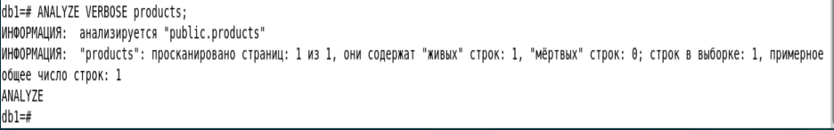

1.  **Оптимизация конфигурации PostgreSQL**

sudo nano /etc/postgresql/12/main/postgresql.conf

shared_buffers = 512MB

{width="4.948606736657918in"
height="1.3856102362204725in"}

Основной кэш Postgresql, рекомендуется выделять 15--25% от оперативной
памяти для выделенных серверов, поэтому установим 512 MB (25% от 4 GB).

work_mem = 4MB

{width="4.094320866141732in"
height="0.8230314960629921in"}

Определяет объём памяти, выделяемый для операций сортировки и
хэш-объединения в рамках одного запроса. Значение задаётся для каждого
отдельного процесса, поэтому его не стоит ставить слишком высоким,
обычно 4--8 MB -- поставим 4 MB.

maintenance_work_mem = 64MB

{width="3.6255063429571304in"
height="0.718850612423447in"}

Память, используемая для административных операций, данные операции
выполняются редко, поэтому можно выделить больше памяти -- обычно
10--20% от оперативной памяти, например, 64 MB.

effective_cache_size = 2GB

{width="2.708711723534558in"
height="0.6980139982502187in"}

Это оценка объёма памяти, доступной для кэширования на уровне
операционной системы, и служит подсказкой для оптимизатора запросов.
Рекомендуется устанавливать значение около 50--75% от общей оперативной
памяти. Для нашей машины можно задать 2 GB.

sudo systemctl restart postgresql

{width="4.6360640857392825in"
height="0.718850612423447in"}

{width="2.864983595800525in"
height="7.2405938320209975in"}

2.  Создание и анализ индексов

Создаем таблицу и заполняем данными, а именно числами от 0 до 1млн

{width="5.042369860017498in"
height="1.718989501312336in"}

Выполняем EXPLAIN ANALYZE до создания индекса и ищем 500 000

{width="6.496527777777778in"
height="2.71875in"}

Теперь создаем INDEX и снова ищем 500 000

{width="6.496527777777778in"
height="2.3652777777777776in"}

И видим, что время поиска значительно сократилось, время выполнения
запроса (execution time) изменилось с 135с до всего 1.9с

3.  Хранимые функции

Создаем код на pl/pySQL

{width="4.177666229221347in"
height="0.531324365704287in"}

{width="6.250872703412074in"
height="3.4588156167979003in"}

CREATE OR REPLACE FUNCTION znachenie_otricatelnoe_ili_net(input_value
INTEGER)

Определяем или пересоздаём функцию с именем add_value_if_positive,
которая принимает один параметр input_value типа INTEGER.

RETURNS TEXT

Функция будет возвращать текстовое сообщение.

LANGUAGE plpgsql

Указываем язык реализации функции --- PL/pgSQL.

BEGIN ... END

Тело функции. Здесь описана логика проверки и вставки.

IF input_value \< 0 THEN ... ELSE ... END IF;

Условие: если число отрицательное --- возвращаем сообщение об ошибке;
иначе вставляем запись в таблицу.

INSERT INTO test_data(number) VALUES (input_value);

Вставка значения в столбец number таблицы test_data.

RETURN \'...\';

Возвращаем сообщение об операции.

Загружаем эту функцию внутри базы данных и проверяем

{width="4.448537839020123in"
height="4.2714293525809275in"}

Проверим, действительно ли есть запись\
{width="6.496527777777778in"
height="1.9in"}

4.  **Триггеры**

Создаем новую таблицу

{width="6.496527777777778in"
height="0.4965277777777778in"}

Создаем скрипт триггер для
цен{width="5.709130577427821in"
height="3.3129625984251967in"}

RETURNS TRIGGER: функция возвращает тип TRIGGER, который необходим для
функций, связанных с триггерами.

IF NEW.price \< 0: мы проверяем новое значение цены, которое пытаются
вставить или обновить.

RAISE EXCEPTION: выбрасываем ошибку с текстом. % подставляет значение
NEW.price.

Создаем функцию в бд и сохраняем как триггер чтобы он выполнялся

{width="6.496527777777778in"
height="1.4069444444444446in"}

Создадим запись

{width="5.354913604549432in"
height="2.166969597550306in"}

И запись с отрицательным числом

{width="5.281987095363079in"
height="0.9793033683289589in"}

5.  **Автоматическая очистка и статистика (VACUUM, ANALYZE)**

Проверяем включен ли он\
{width="1.6356452318460193in"
height="1.7710804899387576in"}

Проверяем настройки

{width="3.1462718722659666in"
height="4.708990594925634in"}

autovacuum_naptime: Интервал между проверками базы данных на
необходимость запуска autovacuum.

autovacuum_vacuum_scale_factor: Доля «мёртвых» строк в таблице, при
достижении которой запускается вакуум.

autovacuum_analyze_scale_factor: Доля изменений в таблице, после которой
будет выполнен ANALYZE для обновления статистики.

VACUUM -- Удаляет «мёртвые» строки, освобождая место и предотвращая
разрастание таблицы.

ANALYZE -- Собирает и обновляет статистику о содержимом таблицы, которую
использует оптимизатор запросов для составления плана выполнения.

{width="1.7085717410323709in"
height="1.0105577427821522in"}

Обычно он ничего не выводит, но можно использовать более расширенный
вывод

{width="6.496527777777778in"
height="4.483333333333333in"}

{width="6.496527777777778in"
height="1.0131944444444445in"}

**pg_stat_user_tables:** содержит статистику по таблицам, принадлежащим
пользователю. Здесь можно увидеть число вызовов autovacuum, manual
vacuum, а также количество строк, обновлений и удаления.

{width="6.496527777777778in"
height="1.5902777777777777in"}

**pg_stat_all_indexes:** содержит статистику по индексам, такую как
число сканирований по индексам.

{width="6.496527777777778in"
height="1.4715277777777778in"}

Другие полезные

**pg_stat_database:** Статистика по базе данных (например, число
autovacuum-вызовов для базы данных в целом).

{width="6.496527777777778in"
height="1.6659722222222222in"}

datname --- имя базы данных.

numbackends --- количество клиентских подключений к базе данных.

xact_commit и xact_rollback --- число подтверждённых и откатанных
транзакций соответственно.

blks_read и blks_hit --- сколько блоков было физически считано с диска и
сколько блоков нашлось в буферном кэше (cache hits).
